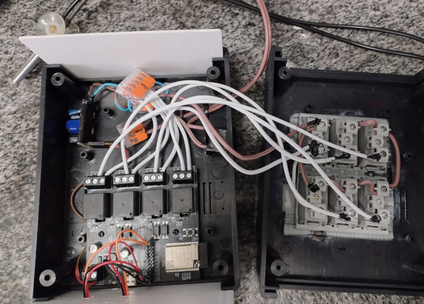

# AquaControl32-4R

AquaControl32-4R is an intelligent [ESP32 LILYGO T-Relay](https://lilygo.cc/en-us/products/t-relay) controller for my 80 L tetra aquarium. It is implemented in Arduino and PlatformIO. It monitors water temperature with a DS18B20 sensor, runs a thermostat, and schedules lights and CO2 on/off events.

The system sends data to ThingSpeak. View the dashboard here: <https://thingspeak.com/channels/2421172>

### Pinout

| Signal | GPIO |
|--------|------|
| Heater 1 relay (K1) | 21 |
| Heater 2 relay (K2) | 18 |
| LED bars relay (K3) | 19 |
| CO2 solenoid relay (K4) | 5 |
| DS18B20 sensor 1 | 22 |
| DS18B20 sensor 2 | 23 |
| On-board status LED | 25 |

## Screenshots

This DIY build is housed in a Shako HT200 plastic box (90x140x180mm) and uses a 4x4 socket panel, [ESP32 LILYGO T-Relay](https://lilygo.cc/en-us/products/t-relay), waterproof DS18B20 sensors, a 12V supply,   wires and wago connectors.

