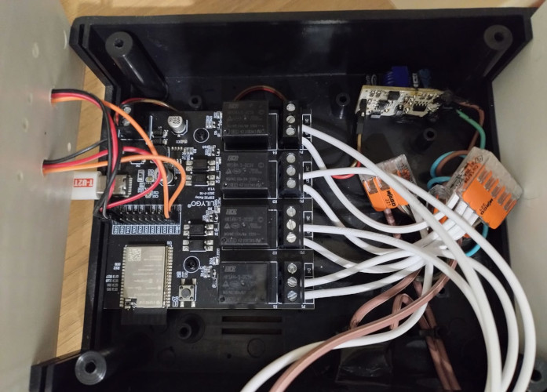
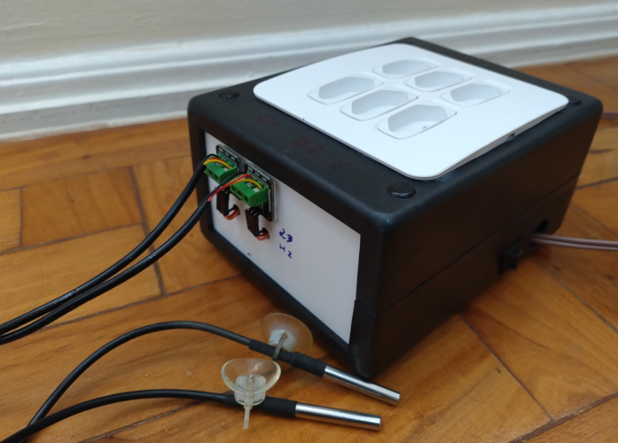

# AquaControl32-4R

AquaControl32-4R is an intelligent [ESP32 T-Relay](https://lilygo.cc/en-us/products/t-relay) controller for my 80 L tetra aquarium. It is implemented in Arduino and PlatformIO. It monitors water temperature with a DS18B20 sensor, runs a thermostat, and schedules lights and CO2 on/off events.

The system sends data to ThingSpeak. **View here**: [ThingSpeak dashboard for channel 2421172](https://thingspeak.mathworks.com/channels/2421172)

The goal is to preserve the health of the aquarium and its fish — black tetras, which thrive in tropical temperatures.

### Pinout & ThingSpeak field mapping

| Signal                  | GPIO | ThingSpeak Field |
|-------------------------|------|-----------------|
| DS18B20 sensor          | 22   | 1               |
| Heater relay (K1)       | 21   | 3               |
| LED bar relay (K2)      | 19   | 5               |
| CO2 solenoid relay (K4) | 5    | 6               |
| On-board status LED     | 25   | —               |

### HTTP endpoints

| Endpoint         | Method | Auth              | Description                                                |
|-------------------|--------|--------------------|--------------------------------------------------------------|
| `/health`         | GET    | none               | Liveness check; returns status, datetime, water temperature and relay states. |
| `/lamp/toggle`    | GET    | HTTP Basic         | Toggles the LED bar relay.                                    |
| `/co2/toggle`     | GET    | HTTP Basic         | Toggles the CO2 solenoid relay.                                |

## Screenshots

This DIY build is housed in a Shako HT200 plastic box (90x140x180mm) and uses a 4x4 socket panel, [ESP32 T-Relay](https://lilygo.cc/en-us/products/t-relay), waterproof DS18B20 sensors, a 12V supply, wires and wago connectors.

<table>
  <tr>
    <td></td>
    <td></td>
    <td></td>
  </tr>
</table>

## TODO

- [x] Remote log via telnet
- [x] Persist thermostat parameters in config
- [ ] Generate OpenAPI spec for the REST API
- [x] Add more metrics to the health check endpoint
- [x] Bug: lamp turned on after cron
- [ ] Log file
- [x] Save mqttPubTopic
- [x] Refactor `main.cpp`: extract `init*()` functions into a separate module (initWifi, initOta, initHttpServer, initCron)
- [x] Wifi reconnecting
